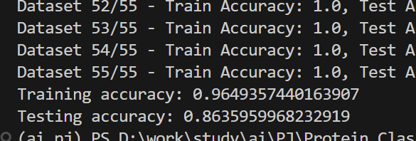
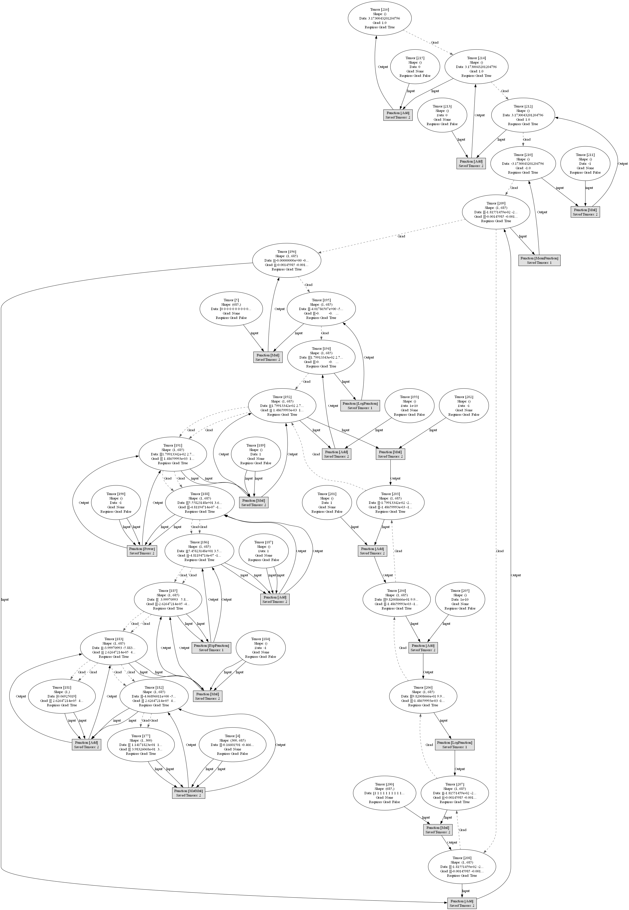
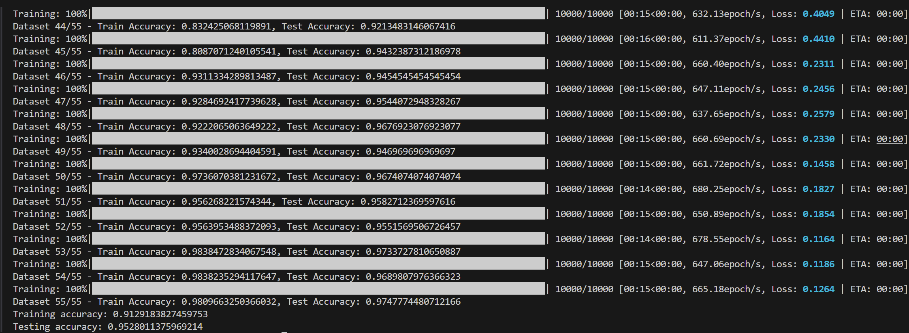

## PJ1: protein classifier

### 补充代码实现蛋白质结构分类（数据处理，LRModel）- 1.5 分

#### 数据处理

##### 数据标准化

```python
mean = np.mean(diagrams, axis=0)
std = np.std(diagrams, axis=0)
diagrams = (diagrams - mean) / (std + 1e-8)
```

- 执行 Z-score 标准化
- 添加极小值(1e-8)防止除零错误

##### 训练集测试集划分 标签格式 0-1 化

```python
for task in range(1, 56):
    task_col = cast.iloc[:, task].to_numpy()
    train_mask = (task_col == 1) | (task_col == 2)  # 训练集标签
    test_mask = (task_col == 3) | (task_col == 4)   # 测试集标签
```

- 循环处理 55 个独立任务
- 通过布尔掩码实现数据筛选
- 标签映射规则：
  - 训练集：1/2 → 1/0
  - 测试集：3/4 → 1/0

```python
train_data = diagrams[train_mask]  # (n_train_samples, features)
test_data = diagrams[test_mask]    # (n_test_samples, features)

train_targets = task_col[train_mask] * (-1) + 2  # 1→1, 2→0
test_targets = task_col[test_mask] * (-1) + 4    # 3→1, 4→0
```

- 通过布尔索引实现高效数据切片
- 线性变换将原始标签编码为二进制形式

#### LRModel

##### 模型结构

```python
class LRModel:
    def __init__(self):
        self.model = LogisticRegression(max_iter=10000, penalty=None)
```

- 基础配置：
  - 无正则化（`penalty=None`）
  - 最大迭代 10000 次确保收敛
  - 默认使用 L-BFGS 优化器

##### 训练流程

```python
def train(self, train_data, train_targets):
    self.model.fit(train_data, train_targets)  # 执行梯度下降
```

- 输入要求：
  - `train_data`: (n_samples, n_features)
  - `train_targets`: (n_samples,) 二进制标签

##### 结果




### 基于梯度下降实现简易的逻辑回归模型 LRFromScratch - 1.5 分

在本 PJ 中，我实现了一个基于动态计算图的自动微分引擎（`.\MyNptorch\mynptorch`）：**只需编写前向传播的损失函数，对损失调用.backward()将自动把梯度反传到各个参与运算的数据上。** 通过重载运算符，自动微分引擎在进行损失计算时自动构建动态计算图，在反传时通过拓扑排序和递归的梯度传导实现梯度计算。

以下是 LRModel 计算图的可视化，实线为前传路线，虚线为梯度传导路线：



#### 核心设计

该系统的核心设计思想基于两个主要组件：

1. **Tensor 类**：表示计算图中的数据节点
2. **Function 类**：表示计算图中的操作节点

系统采用"定义即运行"(Define-by-Run)的动态计算图方式，在执行前向计算的同时构建计算图，然后通过拓扑排序实现高效的反向传播。

#### 核心组件实现

##### Tensor 类

`Tensor`类是整个系统的核心数据结构，用于存储数据并记录计算历史：

- **数据存储**：使用 NumPy 数组存储实际数据
- **梯度存储**：维护梯度信息
- **计算图追踪**：通过`grad_fn`维护与创建该张量的操作的连接
- **唯一标识**：每个张量分配唯一 ID，用于拓扑排序

##### Function 类

`Function`类是所有操作的基类，定义了两个关键方法：

- **forward()**: 执行前向计算
- **backward()**: 计算梯度

所有具体操作（如加法、乘法、矩阵乘法等）都继承自该基类并实现特定的前向和反向计算逻辑。

##### 反向传播算法

实现的反向传播算法基于拓扑排序，主要步骤包括：

1. 从输出节点开始，使用深度优先搜索构建拓扑排序列表
2. 按照逆拓扑顺序（从输出到输入）计算每个节点的梯度
3. 通过链式法则传播和累积梯度

关键代码段：

```python
def backward(self, grad=None):
    # 初始化梯度
    if grad is None:
        grad = Tensor(np.ones_like(self.data))

    # 构建拓扑排序列表
    topo_list = []
    visited = set()
    self._build_topo(visited, topo_list)

    # 按逆拓扑顺序计算梯度
    grad_values = {self.id: grad}
    for tensor in reversed(topo_list):
        if tensor.grad_fn is None:
            continue

        current_grad = grad_values[tensor.id]
        input_grads = tensor.grad_fn.backward(current_grad)

        # 分发梯度到输入节点
        for parent_tensor, parent_grad in zip(
            tensor.grad_fn.saved_for_backward, input_grads
        ):
            if parent_tensor.requires_grad:
                # 累积梯度
                if parent_tensor.id in grad_values:
                    grad_values[parent_tensor.id] += parent_grad
                else:
                    grad_values[parent_tensor.id] = parent_grad
```

##### 支持的运算操作

系统实现了多种基本数学运算：

- **算术运算**：加法、减法、乘法、除法
- **矩阵运算**：矩阵乘法
- **幂运算**：指数计算
- **激活函数**：对数函数、指数函数
- **聚合操作**：求和、平均值

每种操作都包含前向计算和相应的梯度计算规则。例如，乘法操作的实现：

```python
class Mul(Function):
    def forward(self, x, y):
        self.save_for_backward(x, y)
        return x.data * y.data

    def backward(self, grad_output):
        x, y = self.saved_for_backward
        return grad_output * y.data, grad_output * x.data
```

##### 计算图可视化

系统还实现了计算图可视化功能，使用`graphviz`库生成直观的计算图表示：

- 显示张量节点（形状、数据值、梯度信息）
- 显示操作节点（操作类型）
- 表示前向计算路径（实线）
- 表示梯度流动路径（虚线）

#### 使用示例

下面是一个简单的使用示例，展示了如何使用该系统计算一个复合函数的梯度：

```python
# 创建需要跟踪梯度的张量
x = Tensor([2.0], requires_grad=True)
y = Tensor([3.0], requires_grad=True)

# 构建计算表达式：z = x*y + x^2
z = x * y + x**2

# 执行反向传播
z.backward()

# 查看梯度：dz/dx = y + 2x = 3 + 4 = 7
print(f"x.grad = {x.grad}")  # 输出: 7.0

# 查看梯度：dz/dy = x = 2
print(f"y.grad = {y.grad}")  # 输出: 2.0

# 可视化计算图
z.visualize_backward()
```

#### 实验结果

由于样本分布过于不平衡，导致 accuracy 不能很好的反映模型有效性，有大量的 1 标签被误判为 0 标签



