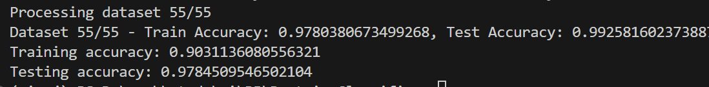
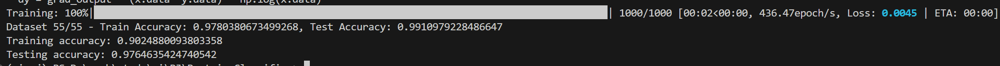

git@github.com:victkk/Protein_Classifier.git

## 补充代码实现调包蛋白质分类

### 数据处理

```python
for task in range(1, 56):  # Assuming only one task for now
    task_col = cast.iloc[:, task].to_numpy()
    train_mask = (task_col == 1) | (task_col == 2)
    test_mask = (task_col == 3) | (task_col == 4)
    train_data = diagrams[train_mask]
    test_data = diagrams[test_mask]
    train_targets = task_col[train_mask] * (-2) + 3
    test_targets = task_col[test_mask] * (-2) + 7
    assert train_targets.shape[0] == train_data.shape[0]
    assert test_targets.shape[0] == test_data.shape[0]
    data_list.append((train_data, test_data))
    target_list.append((train_targets, test_targets))
```

### 模型

```python
class SVMModel:
    def __init__(self, C=1.0, kernel="rbf"):
        self.model = SVC(C=C, kernel=kernel, probability=True)

    def train(self, train_data, train_targets):
        self.model.fit(train_data, train_targets)

    def evaluate(self, data, targets):
        return self.model.score(data, targets)
```

#### 结果

正确率较高，但经观察，样本标签不均衡，导致模型对-1 标签有较大的偏向性。


## 基于梯度下降简易实现支持向量机模型 SVMFromScratch

在 PJ1 中，我已经实现了一个自动构建动态计算图的框架，可根据前传过程自动生成计算图和反传梯度，以下是对 SVM 模型自动生成的计算图


### 用自编框架重写 compute_loss 函数

```python
def compute_loss(self, y, predictions):
    """
    SVM Loss function:
    hinge_loss = 1/2 * ||w||^2 + C * sum(max(0, 1 - y * z))
    """
    num_samples = y.data.shape[0]
    hinge_loss = Tensor.clamp(1 - y * predictions, min=0)
    hinge_loss_sum = Tensor.sum(hinge_loss)
    # 2. Regularization term: 1/2 * ||w||^2
    regularization = 0.5 * Tensor.sum(self.weights**2)
    total_loss = self.C * hinge_loss_sum + regularization
    loss = total_loss / num_samples
    return loss
```

### 基于自编框架的梯度下降

调用 backward 之后，可以直接进行梯度下降

```python
loss.backward()
self.weights -= self.lr * self.weights.grad
self.bias -= self.lr * np.mean(self.bias.grad)
self.weights.grad_fn = None
self.bias.grad_fn = None
```

### 结果展示

正确率较高，但经观察，样本标签不均衡，导致模型对-1 标签有较大的偏向性。


## 附录：自编 MyNptorch 自动微分框架

#### 核心设计

该系统的核心设计思想基于两个主要组件：

1. **Tensor 类**：表示计算图中的数据节点
2. **Function 类**：表示计算图中的操作节点

系统采用"定义即运行"(Define-by-Run)的动态计算图方式，在执行前向计算的同时构建计算图，然后通过拓扑排序实现高效的反向传播。

#### 核心组件实现

##### Tensor 类

`Tensor`类是整个系统的核心数据结构，用于存储数据并记录计算历史：

- **数据存储**：使用 NumPy 数组存储实际数据
- **梯度存储**：维护梯度信息
- **计算图追踪**：通过`grad_fn`维护与创建该张量的操作的连接
- **唯一标识**：每个张量分配唯一 ID，用于拓扑排序

##### Function 类

`Function`类是所有操作的基类，定义了两个关键方法：

- **forward()**: 执行前向计算
- **backward()**: 计算梯度

所有具体操作（如加法、乘法、矩阵乘法等）都继承自该基类并实现特定的前向和反向计算逻辑。

##### 反向传播算法

实现的反向传播算法基于拓扑排序，主要步骤包括：

1. 从输出节点开始，使用深度优先搜索构建拓扑排序列表
2. 按照逆拓扑顺序（从输出到输入）计算每个节点的梯度
3. 通过链式法则传播和累积梯度

关键代码段：

```python
def backward(self, grad=None):
    # 初始化梯度
    if grad is None:
        grad = Tensor(np.ones_like(self.data))

    # 构建拓扑排序列表
    topo_list = []
    visited = set()
    self._build_topo(visited, topo_list)

    # 按逆拓扑顺序计算梯度
    grad_values = {self.id: grad}
    for tensor in reversed(topo_list):
        if tensor.grad_fn is None:
            continue

        current_grad = grad_values[tensor.id]
        input_grads = tensor.grad_fn.backward(current_grad)

        # 分发梯度到输入节点
        for parent_tensor, parent_grad in zip(
            tensor.grad_fn.saved_for_backward, input_grads
        ):
            if parent_tensor.requires_grad:
                # 累积梯度
                if parent_tensor.id in grad_values:
                    grad_values[parent_tensor.id] += parent_grad
                else:
                    grad_values[parent_tensor.id] = parent_grad
```

##### 支持的运算操作

系统实现了多种基本数学运算：

- **算术运算**：加法、减法、乘法、除法
- **矩阵运算**：矩阵乘法
- **幂运算**：指数计算
- **激活函数**：对数函数、指数函数
- **聚合操作**：求和、平均值

每种操作都包含前向计算和相应的梯度计算规则。例如，乘法操作的实现：

```python
class Mul(Function):
    def forward(self, x, y):
        self.save_for_backward(x, y)
        return x.data * y.data

    def backward(self, grad_output):
        x, y = self.saved_for_backward
        return grad_output * y.data, grad_output * x.data
```

##### 计算图可视化

系统还实现了计算图可视化功能，使用`graphviz`库生成直观的计算图表示：

- 显示张量节点（形状、数据值、梯度信息）
- 显示操作节点（操作类型）
- 表示前向计算路径（实线）
- 表示梯度流动路径（虚线）

#### 使用示例

下面是一个简单的使用示例，展示了如何使用该系统计算一个复合函数的梯度：

```python
# 创建需要跟踪梯度的张量
x = Tensor([2.0], requires_grad=True)
y = Tensor([3.0], requires_grad=True)

# 构建计算表达式：z = x*y + x^2
z = x * y + x**2

# 执行反向传播
z.backward()

# 查看梯度：dz/dx = y + 2x = 3 + 4 = 7
print(f"x.grad = {x.grad}")  # 输出: 7.0

# 查看梯度：dz/dy = x = 2
print(f"y.grad = {y.grad}")  # 输出: 2.0

# 可视化计算图
z.visualize_backward()
```
